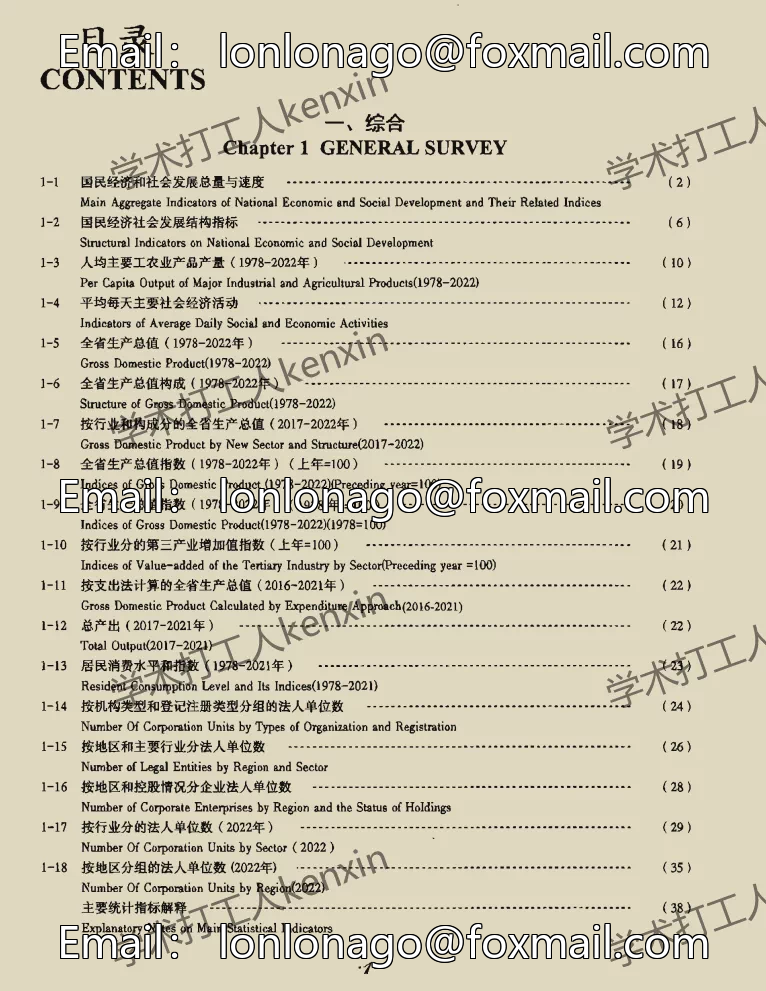
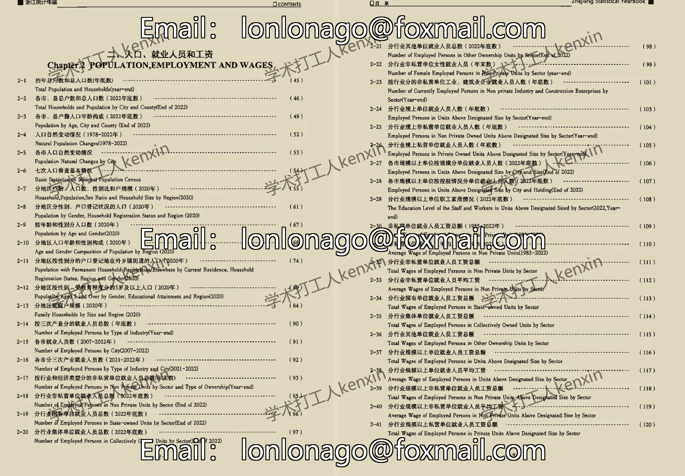
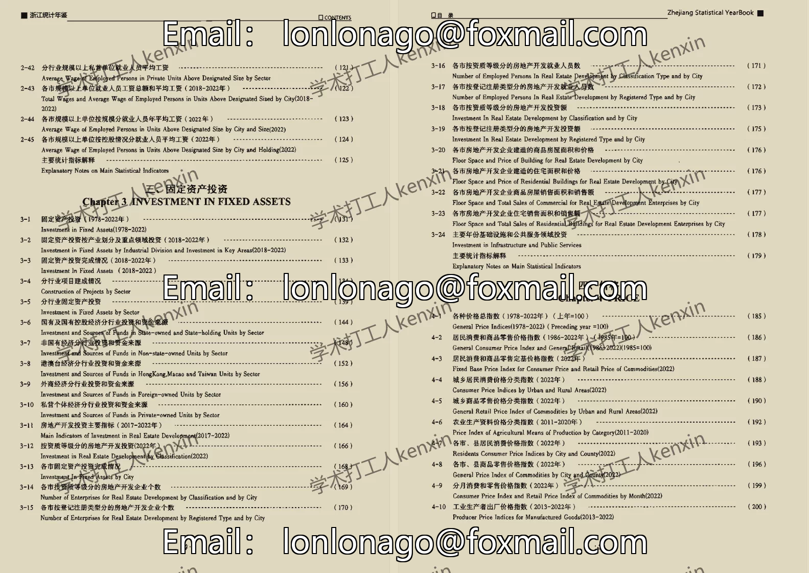
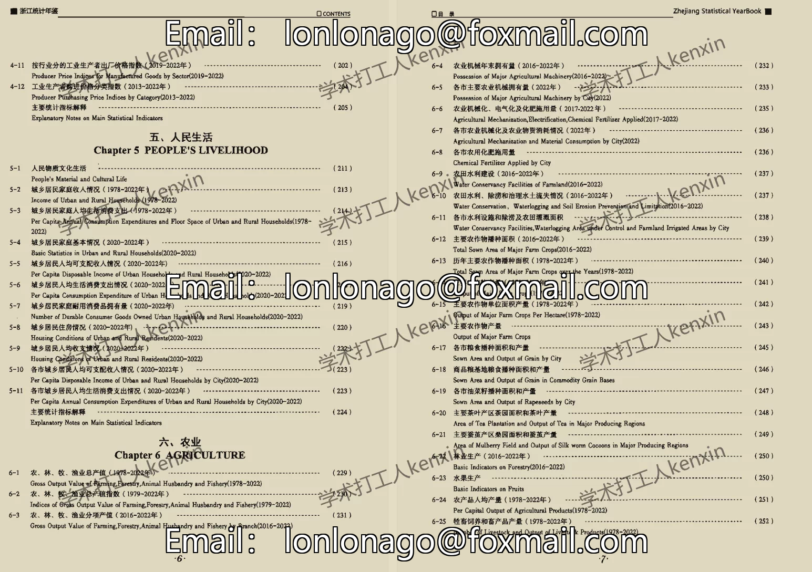
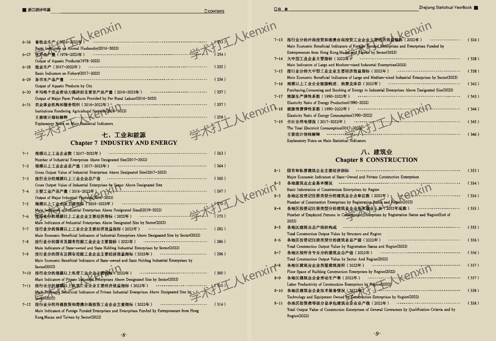
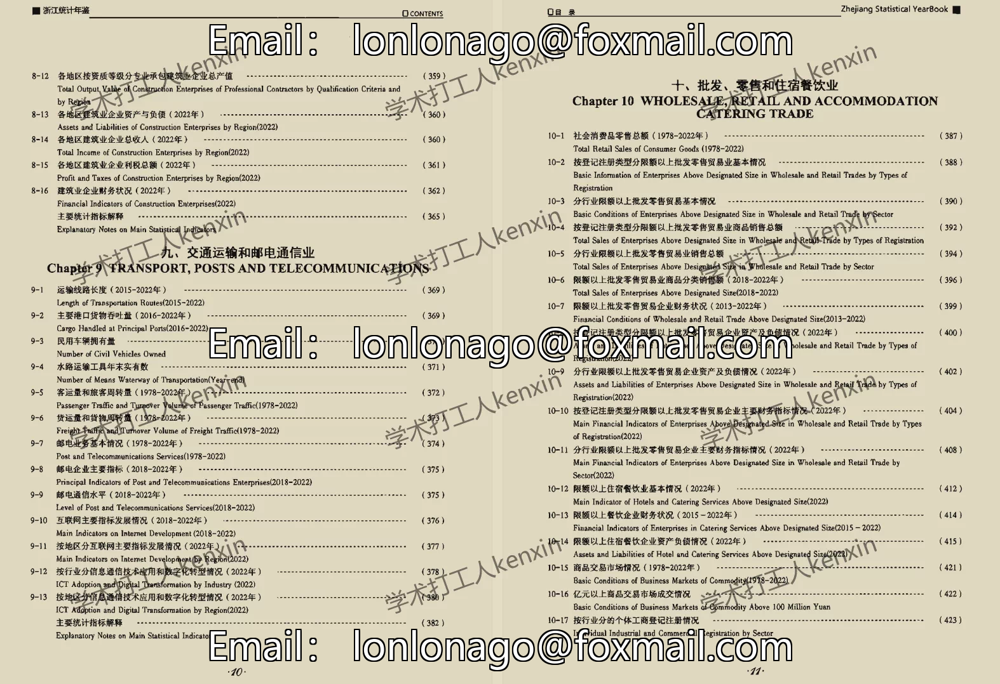
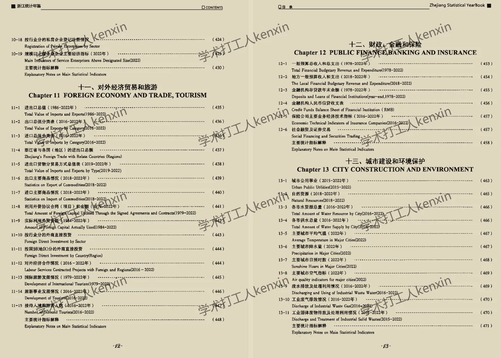
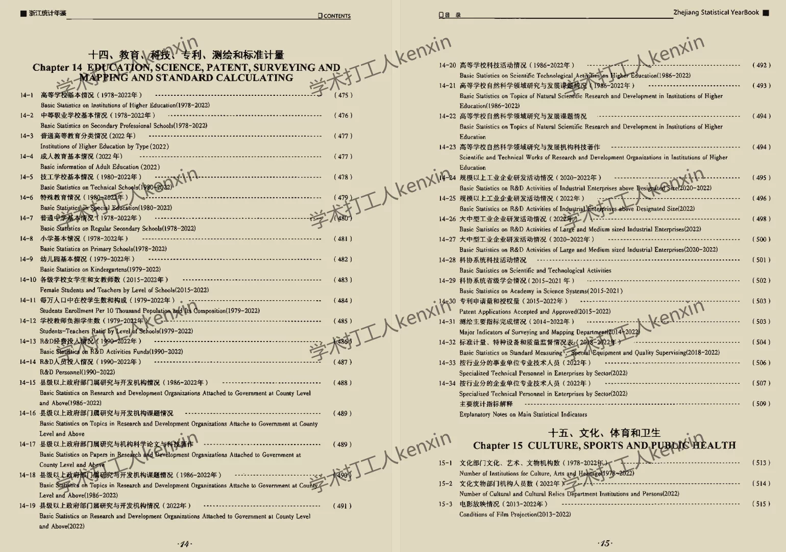

## Body

"Zhejiang Statistical Yearbook" (1984-2025)

Data Year: The title year is the year the data was compiled, so the data year needs to be one less than the title year.
See the image below for a complete display of the description, please confirm if you need it before purchasing! After shipment, any reason not to return or exchange is not accepted!

01. Data Introduction
"Zhejiang Statistical Yearbook"

02. Indicator Details
(1) The directory is shown in the image, but due to limited space, some parts cannot be displayed. Please view on your own and purchase accordingly. If you need help finding specific indicators, all information is here. After shipment, there are no returns or exchanges without reason.
(2) The display directory is for the year 2023, limited by space only showing part of it. The statistical methods may change from year to year. Academic common sense, the data recorded in statistical materials is the data from the previous year, which is also common knowledge. Please be aware of this.
(3) The EXCEL format data is organized from original materials, including the content of the original material data, but not the text content.
(4) If the data is placed in a zip file, you need to save the zip file first, then download, then unzip.
(5) If there is Excel protection, you can select all and copy to a new sheet to use.

03. Data Format
1983-2023 Pdf, excel available, 2025 CD version, 2024 Excel

## Images

item_1072594284348

Here is a pay link on Stripe ( https://buy.stripe.com/3cs8yP7sY87d0vu9AB ). Please contact me lonlonago@foxmail.com after funding $89, and I will send you a complete data files , thank you!

